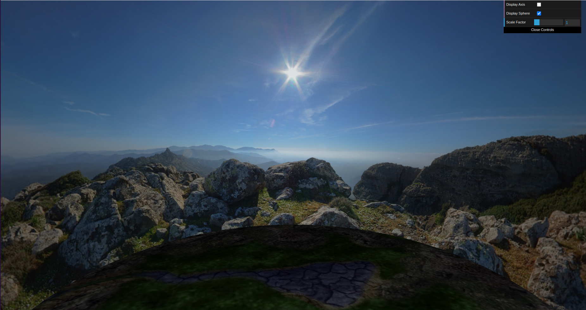
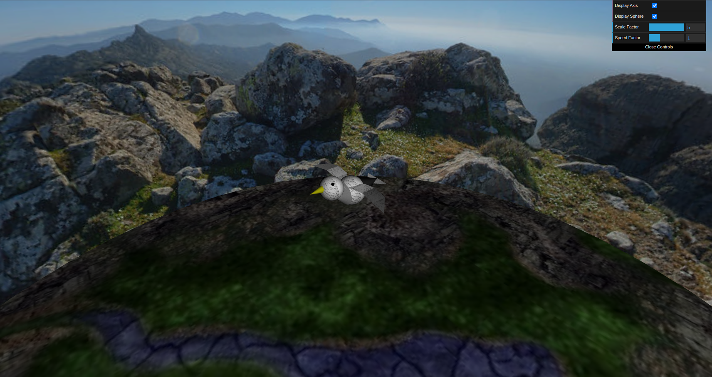
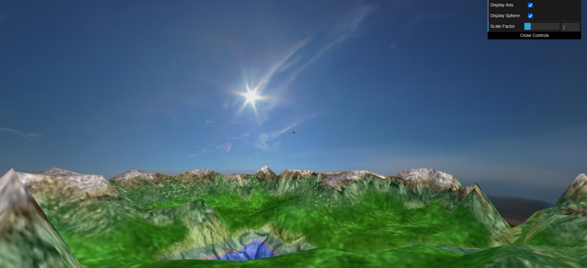
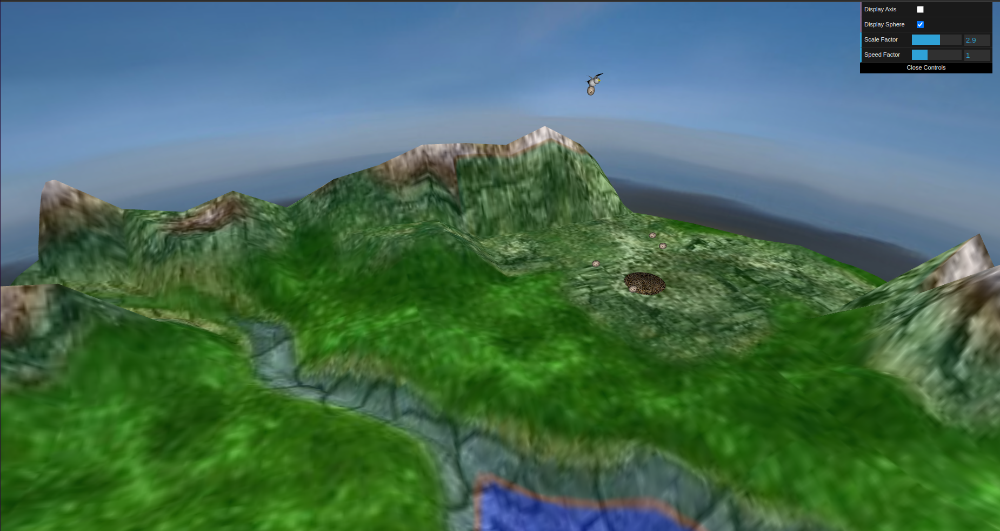
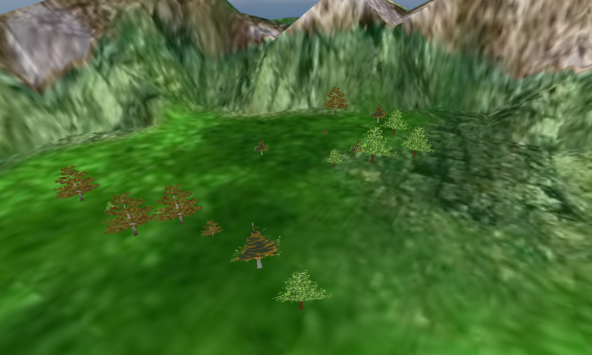
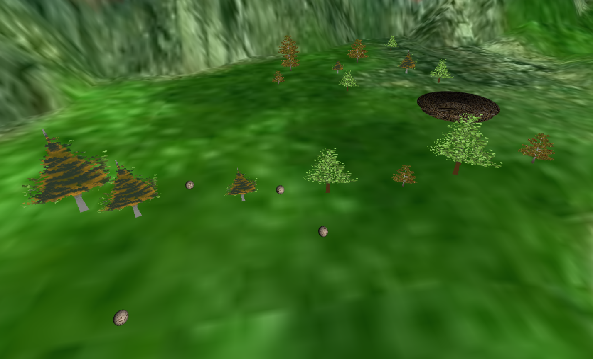

# CG 2022/2023

## Group T06G06

## Project Notes

- In the first picture we can observe our panorama. This was made possible because we sorrounded our field with a giean sphere where our normals were inverted to the inside of the sphere thus being able for us to see the light refleted inside of the sphere.

- To draw our bird we created several classes that draw different shapes. In MyBirdBodyTail we draw a cone, in MyBirdHead we draw a sphere, in MyBirdWing we draw a quadrilateral and in MyBirdTail we draw a triangle. 
- To make the bird a bird we use the functions of translation, rotation and scaling to build our bird in the MyBird.

- For the terrain we started by making a flat plain, we then apply 3 textures with shaders, the shaders take the height map texture to apply some topography to the plane and then apply the terrain map, after that we then applied an altimetry texture by combining the height map, where we mapped each vertical pixel of the altimetry map to a height and then drew them.

- To draw the bird's nest we created a cilinder that has a base with small radius and the top has the opposite thus giving the feeling of a nest. In order to close the nest we applied a plane to the base to close the bottom.
- To draw the eggs we used the same sphere for the the panorama but now the normals are for the outside and the radius is much smaller, also to give the egg shape we scale only one of the three coordinates.
- In our scene we have 6 eggs through a small plane next to the bird's nest.
- When pressing the P button the bird will start to drop and then come back up. If an egg is near the vacinity of the bird it will be picked up and carried by it.
- If the bird is carrying an egg and is close to the nest, if the user presses the O button the egg will drop from the bird and land in the nest.

- For the trees, we started by making a billboard that creates a simple quad, we then had to make the quad rotate in accordance with the camera in order to get the billboard effect, as such we take the camera position and calculate its vector to the quad itself in the x z axis, then we normalize said vector and calculate the rotation needed for the angle to be applied in the transformations before the display.
- We then applied a texture with a shader that would only allow colors to be displayed, we made 2 additional textures for the trees. We then made two additional classes for the tree group and tree line, we applied some randomness to the displaying of the trees using the Math.random function. We then call them in the scene along with the 3 different textures and apply said textures in the scene to prevent loss of performance. 

- We decided to do the wind as our extra, for starters we added a start time on the scene’s init then we modified the vert shader of the billboard to accept the wind intensity and time factor and we also added its update on the update function of the scene.
- In the shader, we set the wind along the z axis, then calculate said wind displacement to the vertices of the quad above .5 get affected using the wind intensity time factor, after that we apply the wobble to the texture.

