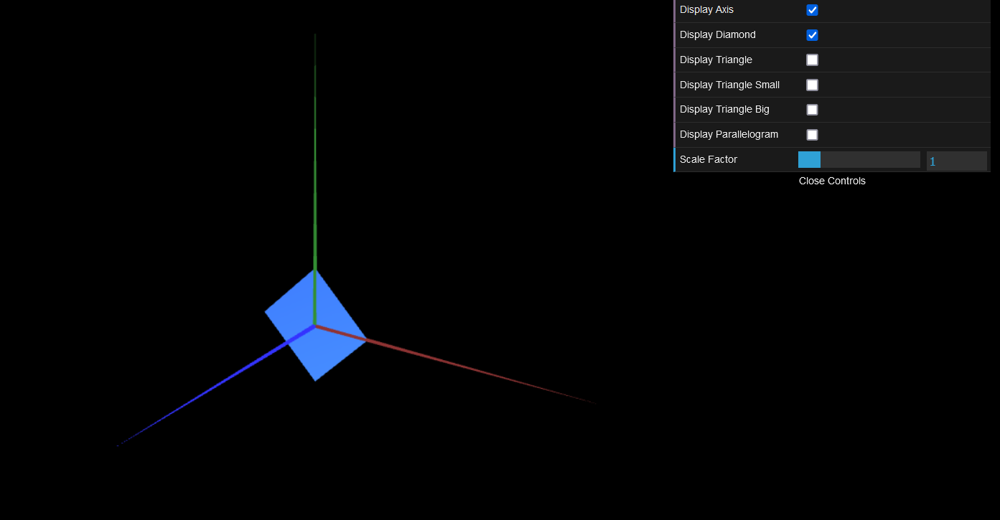
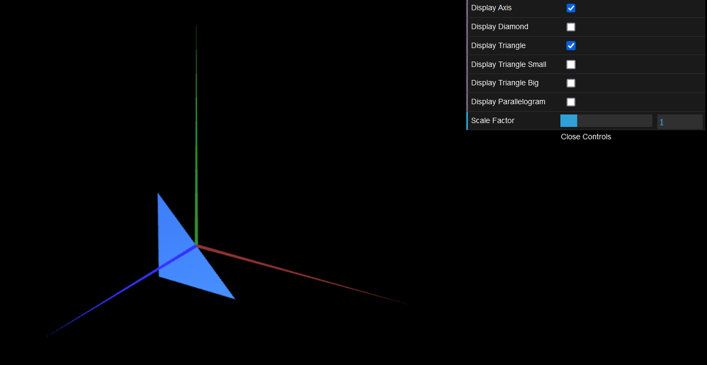
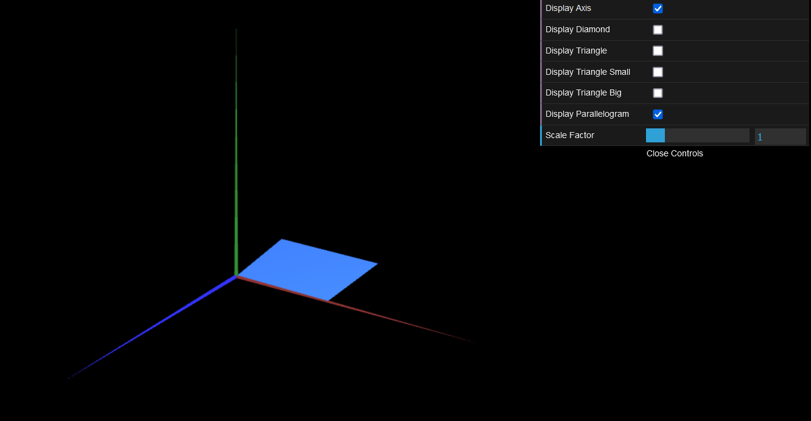
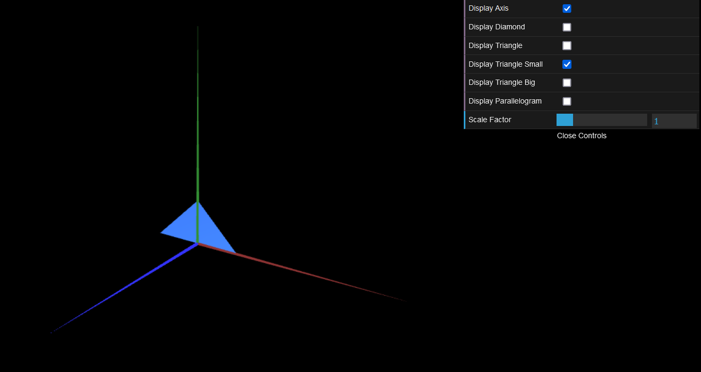
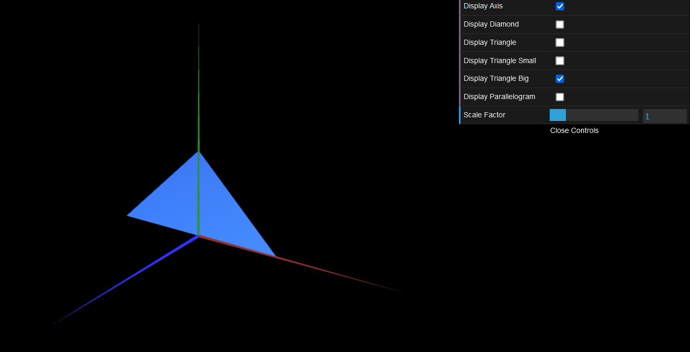

# CG 2022/2023

## Group T06G06

## TP 1 Notes

- On the first exercise we drew a rectangle triangle, a parallelogram and a diamond shapes.
- They were all made toggleable, the same thing was done for the second exercise.
- On the first figure drawn, the triangle, the direction of the points being drawn, let to it being drawn in the wrong axis, but it was fixed, the same concept was latter used for the parallelogram.

- On the second exercise we drew both small and large triangles.

